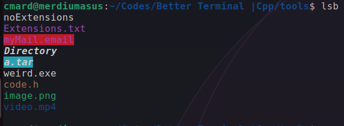
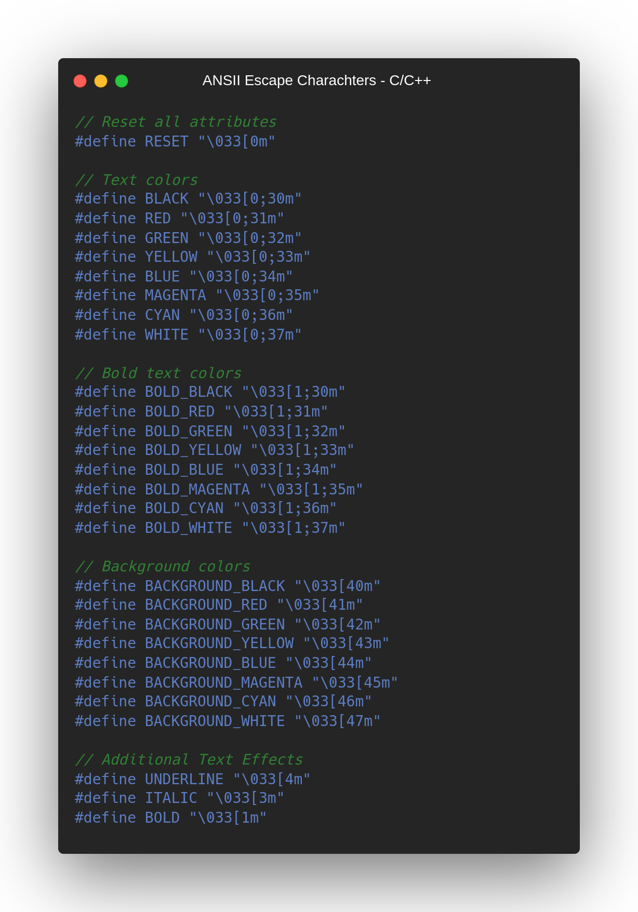
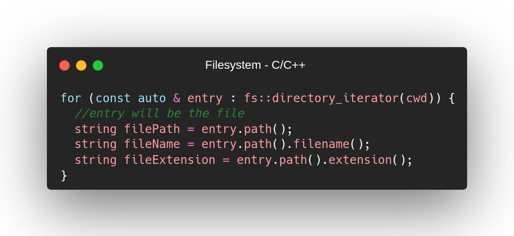

<h4>This is a UNIX/LINUX Command line tool to print files and directories better, based on their extension.</h4>

<h2>Installation</h2>
<h4>To make this working, first we must build executable, then we can add it as alias to execute from everywhere:</h4>

<h2>How It Works<h2>
<h4>To color screen, there's a feature in C/C++ for UNIX/LINUX Systems. They're Called ANSII escape characters:</h4>

 
<h4>I used filesystem library to iterate trough all files and folders in current directory:</h4>

<h4>Made by ~cM</h4>
<h5>Other links : </h5>
<a href="https://discord.gg/5W4XtHkc6g">Discord</a>

